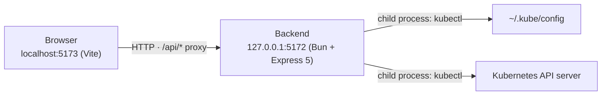
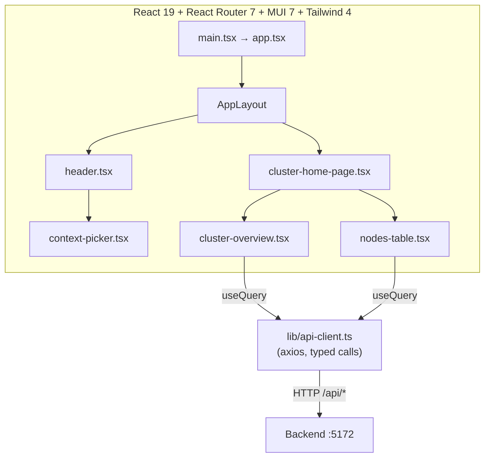
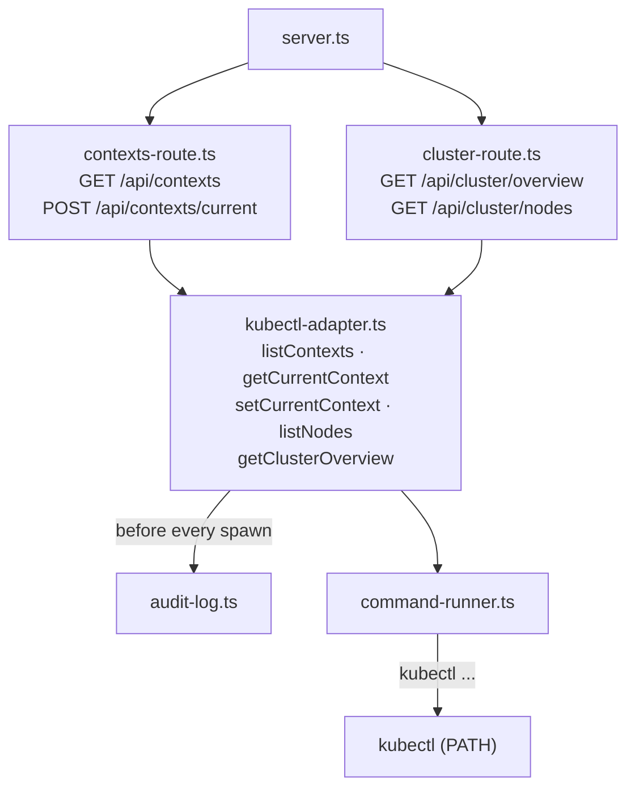

# Karse architecture

Karse is two long-running processes: a Bun + Express backend on port 5172 and a Vite dev server on port 5173. The browser talks only to Vite, which proxies `/api/*` to the backend. The backend shells out to the locally-installed `kubectl` binary for every cluster query.

### System overview

### Frontend detail

### Backend detail

## Layers

- **Browser (React)**: renders the cluster home page. Components never own request state; they call `useQuery`/`useMutation` from TanStack Query, which calls the typed functions in `lib/api-client.ts`, which wrap a single axios instance. The selected kubectl context is held in `lib/kube-context.tsx` (a React Context provider) and read via `useKubeContext()`. Each query key includes the current context, so changing the context refetches automatically.
- **Express backend**: `server.ts` builds the app, applies `express.json()`, mounts the two route modules under `/api`, and installs a single error middleware. Routes are thin: they call adapter functions and shape the JSON response.
- **kubectl adapter** (`kubectl/kubectl-adapter.ts`): a module of free async functions that build kubectl argv, run them through the private `kubectl(args)` helper, and parse the JSON output into the shared contract types from `karse-types`. This is the only place that invokes kubectl.
- **command-runner** (`command-runner.ts`): a thin `node:child_process.spawn` wrapper exporting the free function `run`, which accumulates stdout/stderr and resolves a `CommandResult`.
- **cache** (`kubectl/cache.ts`): an on-disk cache of read-only cluster data. The adapter's `kubectl(args)` helper serves a successful read from a date-stamped JSON file while it is within the configured staleness threshold, and re-caches a fresh read otherwise. Kubeconfig writes and failed reads bypass it, so the read-only invariant holds. The threshold (`config.json`) and the `/api/cache/*` endpoints (`routes/cache-route.ts`) let the UI configure staleness and empty the cache (the navbar refresh button). The cache dir is `KARSE_CACHE_DIR` (default `../cache`). See `docs/spec/cluster-cache`.
- **audit-log** (`audit-log.ts`): appends one line per kubectl call to a rolling text file and prunes old logs at startup. A cache hit serves without spawning kubectl, so it produces no audit line; only live reads are audited.
- **lib/** (`src/lib/`): reusable server-side modules shared across routes and adapters. Analogous to the frontend's `lib/`.

## How kubectl failures surface

When a kubectl call returns a non-zero exit (or the binary is missing), the adapter throws a plain `Error` whose message is kubectl's stderr. Express 5 forwards the rejected promise from the async route handler to the single error middleware, which responds `HTTP 500` with `{ error: err.message }`. The frontend's axios error interceptor turns a non-2xx response into a thrown `Error(response.data?.error ?? response.statusText)`, which TanStack Query surfaces as the query's `error`, rendered as the shared `LoadError` component (an MUI `Alert` with a Retry button).

The frontend's axios client (`frontend/src/lib/api-client.ts`) also sets a default `timeout` of `LOAD_TIMEOUT_MS` (15s) on every `/api/*` request. If the cluster never responds (the VPN/internet is down, so the request times out or never reaches a responding server), the interceptor maps the failure to a connectivity message ending "Make sure your internet or VPN is connected" (`loadErrorMessage` in `frontend/src/lib/load-error.ts`). This stops a page from spinning forever and gives the user a Retry path. A request that did get an HTTP error response keeps the server-provided message.

The one exception is the cluster overview's server-version call: if it fails (rejection or non-zero exit), `serverVersion` is reported as `null` rather than throwing, because a context can be valid in kubeconfig while the API server is unreachable. The three count calls still propagate real errors.

## Resource utilization data flow

The richer CPU/memory utilisation surfaces (cluster cards, health signals, the workloads
table, the nodes/pods bar columns, and the node/pod detail panels) all read from three
performance endpoints, served by the kubectl adapter from data already gathered for the
Performance feature:

- `GET /api/cluster/performance` — the extended `ClusterPerformance`: per-node `usage` /
  `requests` / `allocatable`, cluster-wide `totals`, the `health` signals, and the per-controller
  `workloads` rows. Drives the cluster Overview sections and the nodes/pods table bar columns
  (all sharing one `["cluster-performance", current]` query key, so TanStack Query dedupes to a
  single fetch per context).
- `GET /api/nodes/:name/performance` — the one node's `usage` / `requests` / `allocatable` plus
  its pods' per-pod figures. Drives the node-detail utilisation cards and the per-node pods bars.
- `GET /api/pods/:namespace/:name/performance` — the one pod's summed `usage` / `requests` /
  `limits`. Drives the pod-detail resource panel.

The adapter (`backend/src/kubectl/kubectl-adapter.ts`) builds these by joining three sources:
live **usage** from the Kubernetes Metrics API (`kubectl get --raw`), **requests/limits** from
pod specs, and **allocatable** plus node conditions and container termination reasons from node
and pod status. Usage is optional: when no metrics-server is present the endpoints set
`metricsAvailable: false` and null the usage fields, while requests/allocatable still populate.
A test mode, `KARSE_FAKE_METRICS=1`, returns a canned Metrics API payload so the surfaces can be
exercised against clusters with no metrics-server (e.g. kwok). The shared contract types
(`ClusterResourceTotals`, `ClusterHealthSignals`, `WorkloadUsage`, the extended
`ClusterPerformance`, `NodeUsage.requests`, `Node.instanceType`) live in `packages/karse-types`.

### Shared frontend resource-utilization lib and components

The presentation is shared so every surface reads and behaves the same way:

- `frontend/src/lib/resource-utilization.ts` — pure, React-free helpers: the per-scope
  percentage functions, the absolute formatters, and the threshold classifiers (which return a
  colour-free `{ level, label }` so a later colours plan can map levels → palette without
  touching this file). `node-utilization.ts`, `pod-utilization.ts`, and `node-pod-usage.ts`
  build the per-row figures for the tables.
- `frontend/src/lib/resource-utilization-context.tsx` — a React context holding the shared
  **View mode** (Usage/Requests) and **Value format** (%/Absolute) choice. Each surface wraps its
  bars in a `ResourceUtilizationProvider` so one `ViewToggles` control drives them together.
- `frontend/src/components/resource-utilization/` — the reusable presentational pieces:
  `view-toggles`, `resource-bar-cell` (table-cell bar + value), `metric-card`, `status-badge`,
  `health-signal-card`, `node-summary-strip`, `node-utilization-cards`, and `pod-resource-panel`.
  They are consumed by the cluster Overview sections (`pages/cluster-home/components/`), the nodes
  and pods tables, and the node and pod detail Performance/Pods tabs.

