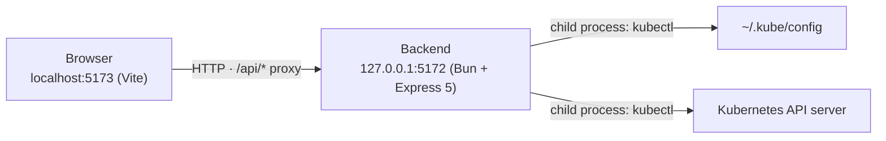
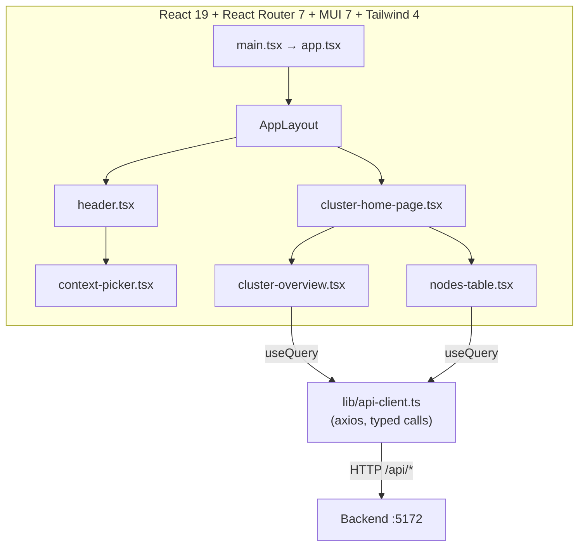
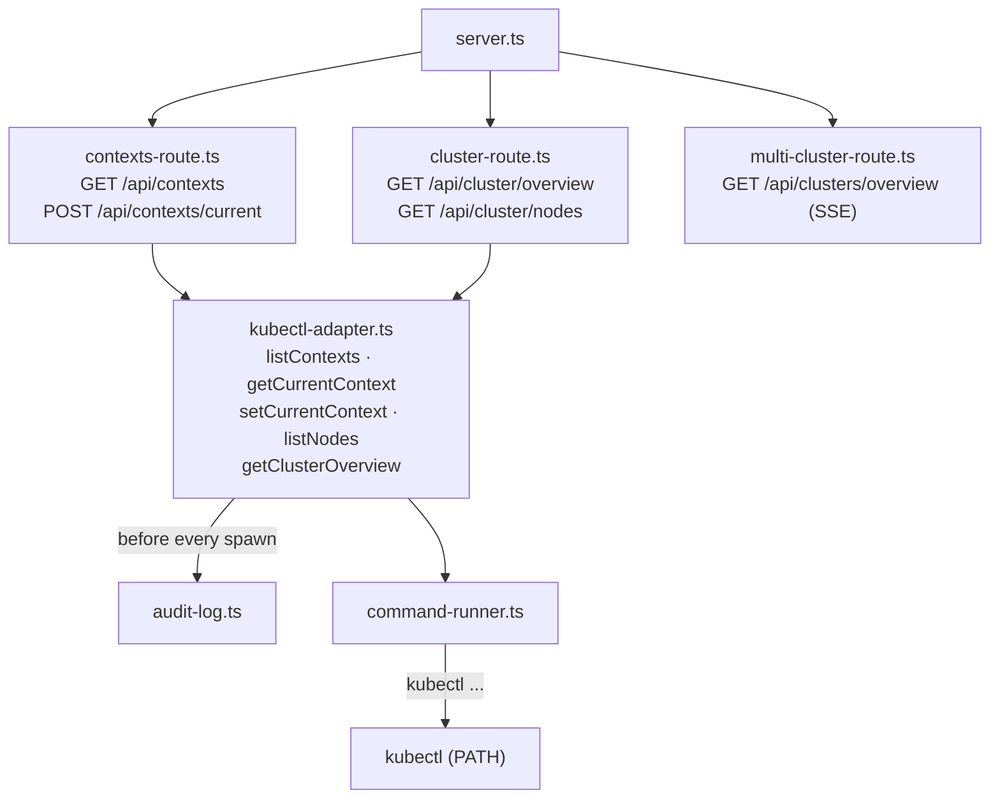

# Karse architecture

Karse is two long-running processes: a Bun + Express backend on port 5172 and a Vite dev server on port 5173. The browser talks only to Vite, which proxies `/api/*` to the backend. The backend shells out to the locally-installed `kubectl` binary for every cluster query.

### System overview

```mermaid
graph LR
    browser["Browser\nlocalhost:5173 (Vite)"]
    backend["Backend\n127.0.0.1:5172 (Bun + Express 5)"]
    kc["~/.kube/config"]
    k8s["Kubernetes API server"]

    browser -->|"HTTP · /api/* proxy"| backend
    backend -->|"child process: kubectl"| kc
    backend -->|"child process: kubectl"| k8s
```

### Frontend detail

```mermaid
graph TD
    subgraph React["React 19 + React Router 7 + MUI 7 + Tailwind 4"]
        main["main.tsx → app.tsx"]
        layout["AppLayout"]
        hdr["header.tsx"]
        picker["context-picker.tsx"]
        home["cluster-home-page.tsx"]
        ov["cluster-overview.tsx"]
        nt["nodes-table.tsx"]
        main --> layout
        layout --> hdr
        hdr --> picker
        layout --> home
        home --> ov
        home --> nt
    end
    api["lib/api-client.ts\n(axios, typed calls)"]
    ov -->|useQuery| api
    nt -->|useQuery| api
    api -->|"HTTP /api/*"| backend["Backend :5172"]
```

### Backend detail

```mermaid
graph TD
    srv["server.ts"]
    cr["contexts-route.ts\nGET /api/contexts\nPOST /api/contexts/current"]
    clr["cluster-route.ts\nGET /api/cluster/overview\nGET /api/cluster/nodes"]
    mcr["multi-cluster-route.ts\nGET /api/clusters/overview (SSE)"]
    srv --> cr
    srv --> clr
    srv --> mcr

    KA["kubectl-adapter.ts\nlistContexts · getCurrentContext\nsetCurrentContext · listNodes\ngetClusterOverview"]

    al["audit-log.ts"]
    cmdr["command-runner.ts"]

    cr --> KA
    clr --> KA
    KA -->|before every spawn| al
    KA --> cmdr
    cmdr -->|"kubectl ..."| kb["kubectl (PATH)"]
```

## Layers

- **Browser (React)**: renders the cluster home page. Components never own request state; they call `useQuery`/`useMutation` from TanStack Query, which calls the typed functions in `lib/api-client.ts`, which wrap a single axios instance. The selected kubectl context is held in `lib/kube-context.tsx` (a React Context provider) and read via `useKubeContext()`. Each query key includes the current context, so changing the context refetches automatically. The user's own display preferences (colour mode, timestamp format, the environment list, per-context environment labels) are held in `lib/config.tsx` and persisted to `localStorage` under `karse-config`; they are frontend-only and never sent to the backend. Two other frontend-only entries sit beside it: each configurable table's column order and hidden columns under `karse-columns-<table>` (`lib/column-config.tsx`), and the Logs page's scope (namespace, ticked pods, picker search text) under `karse-log-scope` (`lib/log-scope-storage.ts`), which is what makes a return to `/logs` land on the same selection. Neither the log stream nor the streamed lines are stored, so a restored scope opens no stream on its own.
- **Context environments**: the contexts page, the header context dropdown (click or `Ctrl+K`) and the All clusters page group contexts by environment. The environment list is the user's, edited on the Config page's Environments subtab and stored in the `karse-config` entry above beside the per-context labels that override it. The whole rule (the default list, compiling the user's expressions, precedence by list order, the label override, the grouping) lives in one non-React module, `lib/cluster-environments.ts`, which all three surfaces import, so there is no second copy to drift; the expressions are compiled once per change to the list in `lib/config.tsx` rather than per context per render. It is purely a display concern: no backend route, no kubectl call, nothing written to the kubeconfig. See `docs/spec/cluster-environments`.
- **The All clusters page's environment sections**: `lib/cluster-environment-groups.ts` folds the per-cluster summaries streamed by `GET /api/clusters/overview` into one section per environment, calling `groupByEnvironment` for the grouping and order and `aggregateClusters` from `karse-types` for each section's figures. The fold is in the frontend because the labels only exist in the browser's `karse-config` entry, so the backend cannot group by them; it re-folds what the stream already sent rather than asking for an environment-aware fetch. See `docs/spec/multi-cluster-overview`.
- **Timestamps**: the backend returns raw ISO timestamps and never formats them. The frontend formats every one of them through `lib/timestamps.ts`, rendered by the `<Timestamp>` component (`components/timestamp.tsx`), which reads the app-wide age/local-time mode from `lib/config.tsx`. So one setting switches every timestamp in the app, and no page formats a timestamp itself. See `docs/spec/timestamp-format`.
- **Table search boxes**: every resource table renders the one `<SearchBox>` component (`components/search-box.tsx`), which owns the field, its magnifying-glass adornment and its clear button, and takes the placeholder plus the `search`/`setSearch` pair from `lib/use-search-filter.ts` as props. No table builds its own search field, so the boxes cannot drift apart. `use-search-filter.ts` also mirrors the committed query into the page's URL query string (key `q` by default, overridable so two searchable tables on one route keep separate params), as a history replace built from the params already there, so a narrowed table is shareable and the back button restores it. See `docs/spec/resource-search`.
- **Express backend**: `server.ts` builds the app, applies `express.json()`, mounts the two route modules under `/api`, and installs a single error middleware. Routes are thin: they call adapter functions and shape the JSON response.
- **kubectl adapter** (`kubectl/kubectl-adapter.ts`): a module of free async functions that build kubectl argv, run them through the private `kubectl(args)` helper, and parse the JSON output into the shared contract types from `karse-types`. This is the only place that invokes kubectl.
- **Resource kinds** (`packages/karse-types`, `RESOURCE_KINDS` and `isReadableResourceKind`): one table of the kinds Karse knows, mapping the URL/API token to that kind's display kind, the resource name handed to `kubectl get`, and whether it is namespaced. Both sides share it, so the frontend and the backend cannot disagree about a kind's name or scope. The table is knowledge, not permission: what stands between a caller-supplied kind and the kubectl argument list is `isReadableResourceKind`, which requires the token to look like a kubectl resource name (so it can never be read as a flag) and refuses the kinds Karse will not read (Secrets). A kind absent from the table is still served, so a custom resource has a detail page like anything else. See `docs/spec/generic-detail`.
- **command-runner** (`command-runner.ts`): a thin `node:child_process.spawn` wrapper exporting the free function `run`, which accumulates stdout/stderr and resolves a `CommandResult`.
- **cache** (`kubectl/cache.ts`): an on-disk cache of read-only cluster data. The adapter's `kubectl(args)` helper serves a successful read from a date-stamped JSON file while it is within the configured staleness threshold, and re-caches a fresh read otherwise. Kubeconfig writes and failed reads bypass it, so the read-only invariant holds. The threshold (`config.json`) and the `/api/cache/*` endpoints (`routes/cache-route.ts`) let the UI configure staleness and empty the cache (the navbar refresh button). The cache dir is `KARSE_CACHE_DIR` (default `../cache`). See `docs/spec/cluster-cache`.
- **audit-log** (`audit-log.ts`): appends one line per kubectl call to a rolling text file and prunes old logs at startup. A cache hit serves without spawning kubectl, so it produces no audit line; only live reads are audited.
- **lib/** (`src/lib/`): reusable server-side modules shared across routes and adapters. Analogous to the frontend's `lib/`.

## How kubectl failures surface

When a kubectl call returns a non-zero exit (or the binary is missing), the adapter throws a plain `Error` whose message is kubectl's stderr. Express 5 forwards the rejected promise from the async route handler to the single error middleware, which responds `HTTP 500` with `{ error: err.message }`. The frontend's axios error interceptor turns a non-2xx response into a thrown `Error(response.data?.error ?? response.statusText)`, which TanStack Query surfaces as the query's `error`, rendered as the shared `LoadError` component (an MUI `Alert` with a Retry button).

The frontend's axios client (`frontend/src/lib/api-client.ts`) also sets a default `timeout` of `LOAD_TIMEOUT_MS` (15s) on every `/api/*` request. If the cluster never responds (the VPN/internet is down, so the request times out or never reaches a responding server), the interceptor maps the failure to a connectivity message ending "Make sure your internet or VPN is connected" (`loadErrorMessage` in `frontend/src/lib/load-error.ts`). This stops a page from spinning forever and gives the user a Retry path. A request that did get an HTTP error response keeps the server-provided message.

The one exception is the cluster overview's server-version call: if it fails (rejection or non-zero exit), `serverVersion` is reported as `null` rather than throwing, because a context can be valid in kubeconfig while the API server is unreachable. The three count calls still propagate real errors.

## Resource utilization data flow

The richer CPU/memory utilisation surfaces (cluster cards, health signals, the workloads
table, the nodes/pods bar columns, and the node/pod detail panels) all read from three
performance endpoints, served by the kubectl adapter from data already gathered for the
Performance feature:

- `GET /api/cluster/performance` — the extended `ClusterPerformance`: per-node `usage` /
  `requests` / `allocatable`, cluster-wide `totals`, the `health` signals, and the per-controller
  `workloads` rows. Drives the cluster Overview sections and the nodes/pods table bar columns
  (all sharing one `["cluster-performance", current]` query key, so TanStack Query dedupes to a
  single fetch per context).
- `GET /api/nodes/:name/performance` — the one node's `usage` / `requests` / `allocatable` plus
  its pods' per-pod figures. Drives the node-detail utilisation cards and the per-node pods bars.
- `GET /api/clusters/overview` — the multi-cluster overview (`kubectl/multi-cluster.ts`): a
  Server-Sent Events stream that fans out over every kubeconfig context, calling the same
  `getClusterPerformance` per context, and emits a `ClusterSummary` as each lands followed by the
  aggregate `MultiClusterTotals`. The fan-out is bounded (4 contexts at a time) and each context
  is capped by a 20s timeout, so a dead context cannot hold the page; every read goes through the
  cluster cache, so it shares cached entries with the per-cluster pages. The aggregate sums
  absolute usage and capacity across clusters and derives the percentage from those sums, so a
  large cluster weighs more than a small one. That fold, `aggregateClusters`, lives in the shared
  `packages/karse-types` workspace package rather than in the backend, because the frontend runs
  the same one over each environment's clusters for the page's per-environment sections; one
  implementation is what stops a section's numbers and the grand total drifting apart. See
  `docs/spec/multi-cluster-overview`.
- `GET /api/pods/:namespace/:name/performance` — the one pod's summed `usage` / `requests` /
  `limits`. Drives the pod-detail resource panel.

The adapter (`backend/src/kubectl/kubectl-adapter.ts`) builds these by joining three sources:
live **usage** from the Kubernetes Metrics API (`kubectl get --raw`), **requests/limits** from
pod specs, and **allocatable** plus node conditions and container termination reasons from node
and pod status. Usage is optional: when no metrics-server is present the endpoints set
`metricsAvailable: false` and null the usage fields, while requests/allocatable still populate.
A test mode, `KARSE_FAKE_METRICS=1`, returns a canned Metrics API payload so the surfaces can be
exercised against clusters with no metrics-server (e.g. kwok). The shared contract types
(`ClusterResourceTotals`, `ClusterHealthSignals`, `WorkloadUsage`, the extended
`ClusterPerformance`, `NodeUsage.requests`, `Node.instanceType`) live in `packages/karse-types`.

### Shared frontend resource-utilization lib and components

The presentation is shared so every surface reads and behaves the same way:

- `frontend/src/lib/resource-utilization.ts` — pure, React-free helpers: the per-scope
  percentage functions, the absolute formatters, and the threshold classifiers (which return a
  colour-free `{ level, label }` so a later colours plan can map levels → palette without
  touching this file). `node-utilization.ts`, `pod-utilization.ts`, and `node-pod-usage.ts`
  build the per-row figures for the tables.
- `frontend/src/lib/resource-utilization-context.tsx` — a React context holding the shared
  **View mode** (Usage/Requests) and **Value format** (%/Absolute) choice. Each surface wraps its
  bars in a `ResourceUtilizationProvider` so one `ViewToggles` control drives them together.
- `frontend/src/components/resource-utilization/` — the reusable presentational pieces:
  `view-toggles`, `resource-bar-cell` (table-cell bar + value), `metric-card`, `status-badge`,
  `health-signal-card`, `node-summary-strip`, `node-utilization-cards`, and `pod-resource-panel`.
  They are consumed by the cluster Overview sections (`pages/cluster-home/components/`), the nodes
  and pods tables, and the node and pod detail Performance/Pods tabs.

