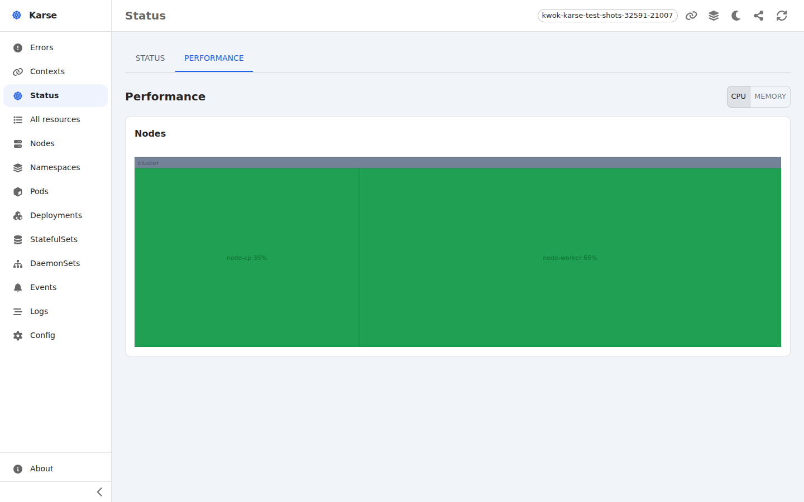
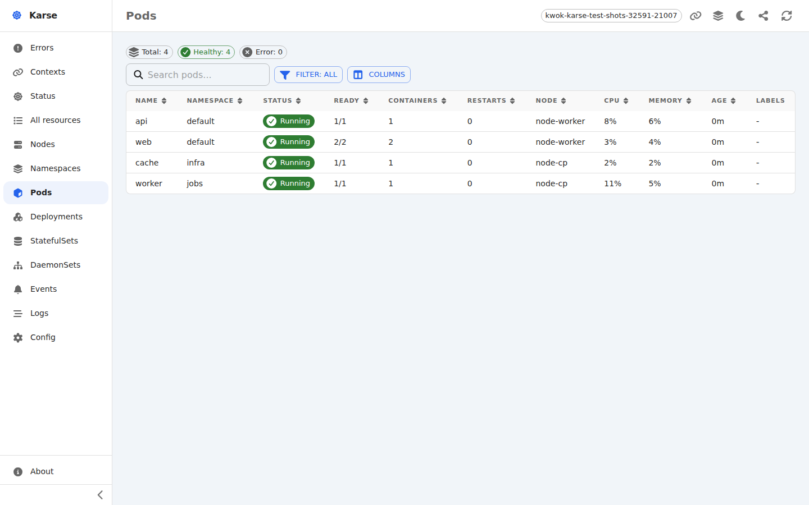
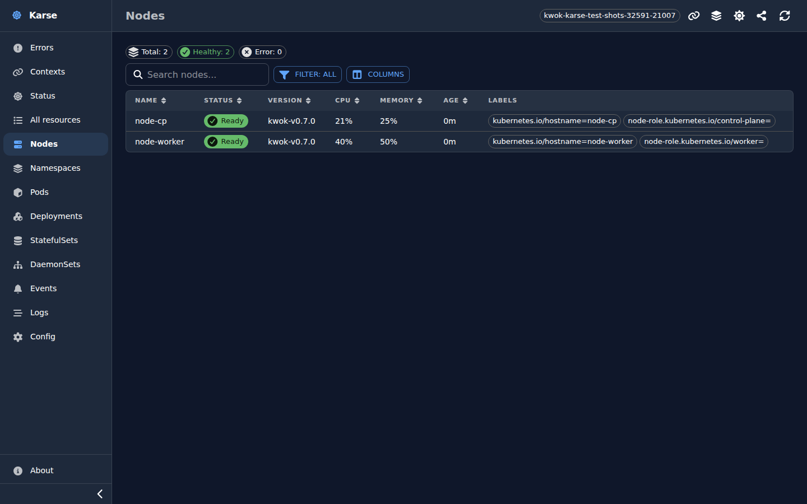
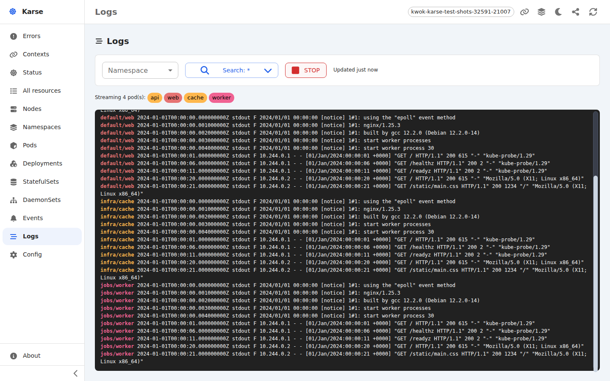

# Karse

Karse is a local-only Kubernetes dashboard that wraps your locally-installed `kubectl` binary. It runs entirely on your own machine and shells out to `kubectl` for read-only cluster queries. It is for information only: it never mutates cluster state, and the only thing it writes is the active context in your kubeconfig (via `kubectl config use-context`).

For the full list of what Karse can do, see the spec at [`docs/spec/index.md`](docs/spec/index.md).

## Screenshots

The cluster performance screen, breaking each node's CPU and memory usage down as a treemap:



The pods table, with live CPU and memory usage per pod:



The nodes table (shown in dark mode), with CPU and memory usage per node:



Streaming pod logs, multiplexed across pods and colour-coded by source:



## Requirements

- `kubectl` available on your `PATH`, already configured against at least one kubeconfig context. If you use [mise](https://mise.jdx.dev), `mise trust && mise install` at the repo root installs the pinned version.
- [`bun`](https://bun.sh) installed and on your `PATH`. If you use [mise](https://mise.jdx.dev), `mise trust && mise install` at the repo root will install the pinned version.
- At least one configured kubeconfig context. Karse never reads your kubeconfig directly; it shells out to `kubectl`, which resolves the kubeconfig itself. Karse does not create clusters or credentials. Karse does not directly read your kubeconfig or credentials.

## Getting the code

```sh
git clone git@github.com:ashleydavis/karse.git
cd karse
```

## Getting started

1. (Optional) Quick install for Bun, if you use [mise](https://mise.jdx.dev):
   ```sh
   mise trust
   mise install
   ```
2. Install Bun dependencies:
   ```sh
   bun install
   ```
3. Start Karse:
   ```sh
   bun start
   ```
   Open http://localhost:5173. 
   
   Use `bun run dev` instead for hot reload during development.

## Documentation

The guide files under `docs/`:

- [`architecture.md`](docs/architecture.md): system layers, the read-only kubectl invariant, the local-only threat model, and how failures surface.
- [`api.md`](docs/api.md): every HTTP endpoint with request/response types, status codes, and curl examples.
- [`user-guide.md`](docs/user-guide.md): end-user tour of the cluster home page.
- [`audit-log.md`](docs/audit-log.md): what Karse logs, where, in what format, and for how long.
- [`security.md`](docs/security.md): safety and security Q&A (read-only invariant, network exposure, accepted risks).
- [`setup.md`](docs/setup.md): how to set up the project (and a worktree) to run, test, and develop.
- [`development.md`](docs/development.md): development setup, testing, and contributing guide.
- [`roadmap.md`](docs/roadmap.md): upcoming features and what has already shipped.
